# Multimodal EEG ECG Framework for Evaluating Emotional Valence and Arousal Using the DREAMER Dataset
## 1. Introduction
Affective information processing is a fundamental cognitive mechanism through which humans evaluate environmental stimuli and adjust attention, behavior, and physiological states. According to Russell’s Circumplex Model of Affect, emotions can be described along two orthogonal dimensions: valence, referring to the degree of pleasantness, and arousal, referring to the intensity of physiological activation. Examining how neural and cardiac signals change during emotional evaluation is therefore important for understanding human affective responses and improving human-computer interaction.

This project investigates these responses using the DREAMER dataset, which provides synchronized electroencephalogram (EEG) and electrocardiogram (ECG) recordings during audio-visual emotion elicitation. To clearly compare affective dimensions, two contrasting conditions were selected: calm, representing high valence and low arousal, and fear, representing low valence and high arousal. A focused analysis was conducted on two participants, and only the final 60 seconds of each stimulus recording were extracted to capture periods in which the target emotions were expected to be fully elicited.

Two physiological mechanisms were examined. Emotional valence was assessed using EEG-derived Frontal Alpha Asymmetry (FAA), calculated from alpha power in the F3 and F4 frontal channels. Based on Davidson’s Approach-Withdrawal Model, stronger relative left-frontal activation indicates positive affect, whereas right-frontal dominance reflects negative affect. Autonomic arousal was evaluated using ECG-derived Heart Rate Variability (HRV), including RMSSD and the LF/HF ratio. RMSSD reflects parasympathetic regulation, while LF/HF indicates autonomic balance. By integrating EEG and ECG features, this project provides an interpretable multimodal framework for characterizing emotional responses to dynamic visual stimuli.

## 2. Data Description

Data Source

  
Raw EEG and ECG signals are sourced from the DREAMER dataset.

- Kaggle: https://www.kaggle.com/datasets/phhasian0710/dreamer/data
- Katsigiannis, S., & Ramzan, N. (2018). DREAMER: A database for emotion recognition through EEG and ECG signals from wireless low-cost off-the-shelf devices. *IEEE Journal of Biomedical and Health Informatics*, 22(1), 98–107. https://doi.org/10.1109/JBHI.2017.2688959

Recording Device Info

| Item | Description |
|------|-------------|
| Signals recorded | EEG and ECG |
| EEG device | Emotiv EPOC wireless EEG headset |
| EEG channels | 14 channels |
| EEG sampling rate | 128 Hz |
| ECG device | Shimmer2 ECG sensor |
| ECG channels | 2 channels |
| ECG sampling rate | 256 Hz |
| Emotion labels | Participants rated valence, arousal, and dominance after each stimulus |

Original Purpose

The data were originally collected to evaluate whether low-cost, wireless, wearable EEG/ECG devices can be used for affective computing and emotion recognition.

## 3. Data Preprocessing

Visual Inspection & Artifact Identification

#### Participant 3 — Stimuli 15 (Calm)
EEG: 323.42 µV/cm | ECG: 200 µV/cm

**Eye Blink Artifact**
At 14–15s, a sharp transient deflection is observed predominantly in frontal channels (AF3, F7, F3, FC5, AF4, F4, F8), with minimal effect on posterior channels (P8, O1, O2). Eye blinks should only appear in frontal leads without spreading to posterior regions.

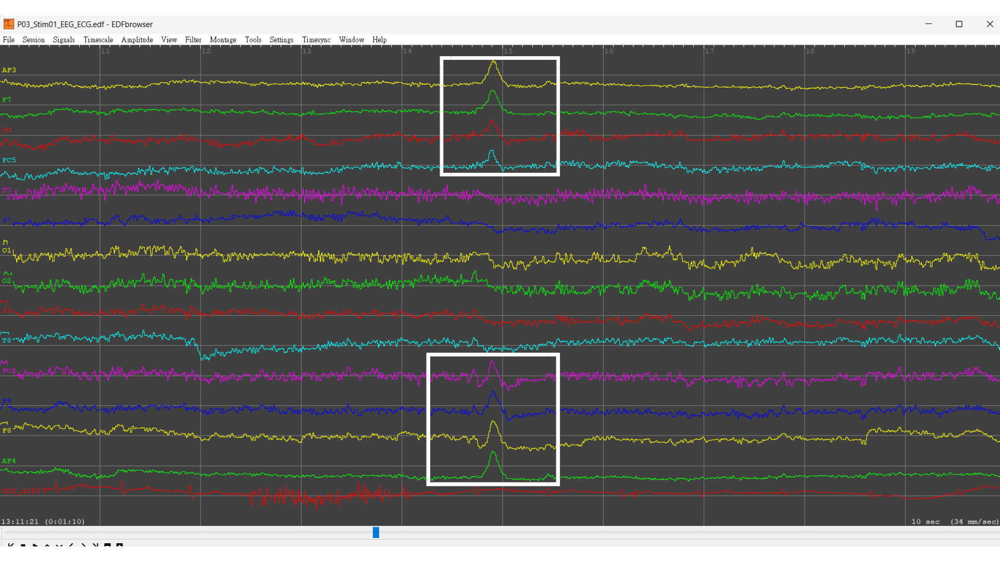

---

#### Participant 4 — Stimuli 4 (Fear)
EEG: 334.48 µV/cm | ECG: 253.04 µV/cm

**Sweat Artifact & Electrode Disconnection**
At ~9–12s, a slow bilateral baseline drift is observed across multiple channels (~3s duration, < 0.5 Hz) with no specific topographic pattern — consistent with sweat artifact. Channel F7 shows a flat line throughout, indicating electrode disconnection. At ~12s, an abrupt return to baseline is observed, likely due to a brief head movement.

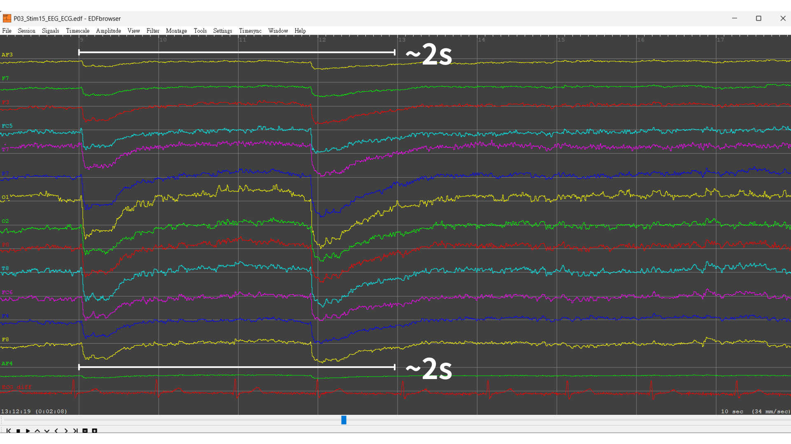

Spectral & Time-Series Proof

  
  

  
 EEG Time-Series

    Time-series signals before and after preprocessing (bandpass filtering + artifact removal):
    
  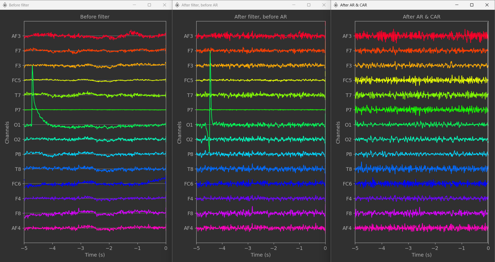
  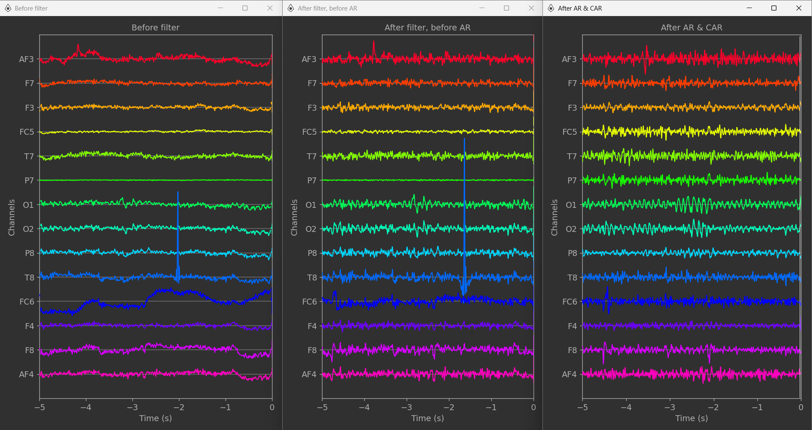
  

  
  

  
 EEG Spectral

    Power Spectral Density (PSD) before and after preprocessing (bandpass filtering + artifact removal):
    
  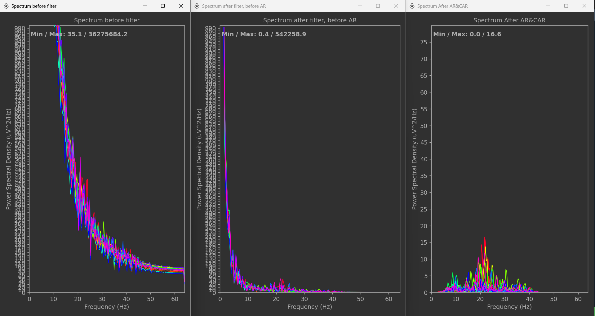
  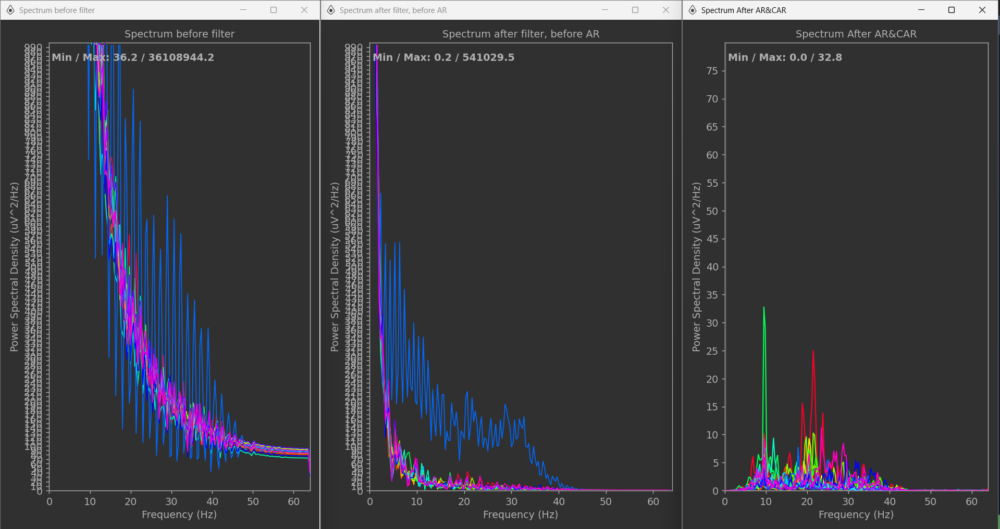
  

  
  

  
 ECG Spectral

    Power Spectral Density (PSD) before and after bandpass filtering:
    
  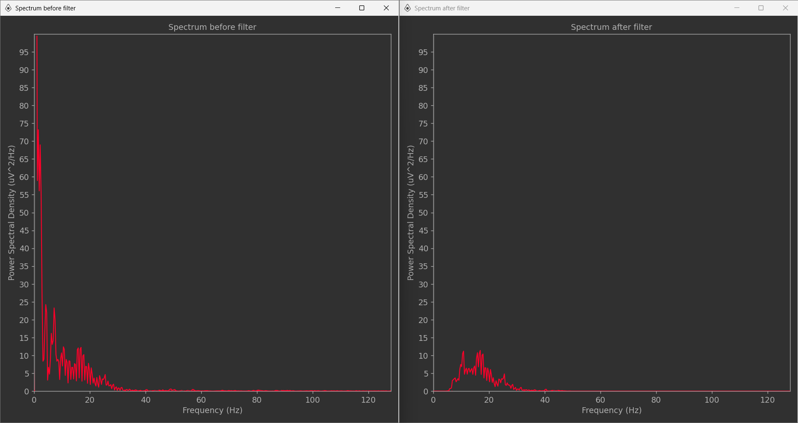
  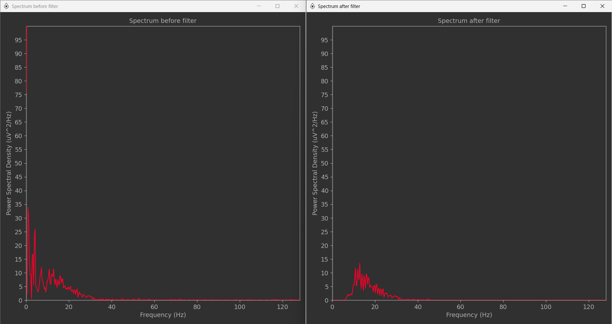
  

## 4. NeuroPype Pipeline

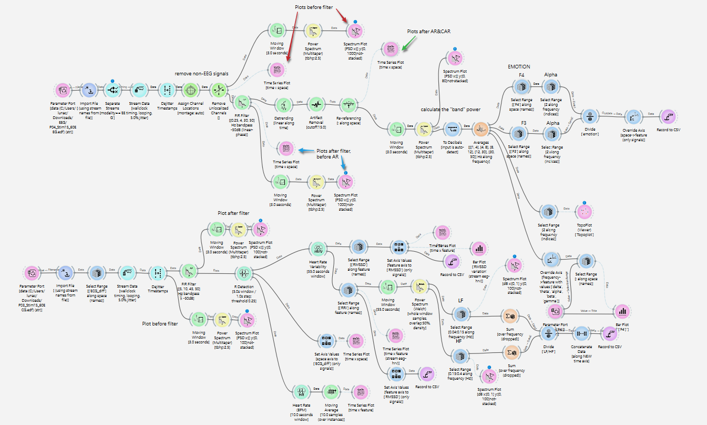

Click the below for complete information:
https://drive.google.com/file/d/1cDDj1-EVk4VkKCEZEuVvr-xp128mZdFV/view?usp=drive_link

Pipeline Architecture & Workflow

  

 EEG Pipeline 

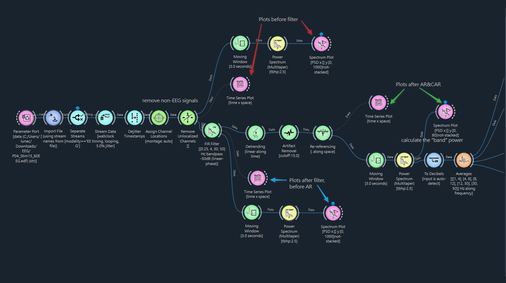
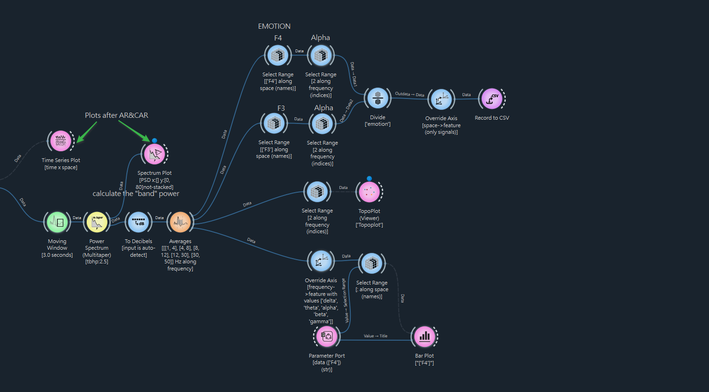
| Node | Function |
|------|----------|
| `ImportFile` | Load the EDF file containing synchronized EEG and ECG recordings |
| `SeparateStreams` | Separate EEG and ECG into independent processing streams |
| `StreamData / DejitterTimestamps` | Correct irregular timestamps from wireless transmission latency |
| `AssignChannelLocations` | Assign 10-20 electrode positions required for CAR referencing |
| `RemoveUnlocalizedChannels` | Remove channels without spatial location information |
| `FIRFilter [0.25, 4, 30, 50 Hz]` | Bandpass filter to retain EEG-relevant frequencies (4–30 Hz), removing DC offset and high-frequency noise |
| `Detrend` | Remove residual low-frequency baseline drift |
| `ArtifactRemoval (ASR, threshold=15)` | Remove high-amplitude artifacts caused by movement and muscle activity |
| `Rereferencing (CAR)` | Apply Common Average Reference to reduce spatial bias from electrode placement |
| `MovingWindow (3s) → MultitaperSpectrum → Averages` | Compute band power for delta, theta, alpha, beta, gamma |
| `SelectRange (F4) / (F3) → Divide` | Compute FAA ratio (α F4 / α F3) for valence estimation |

  

ECG Pipeline

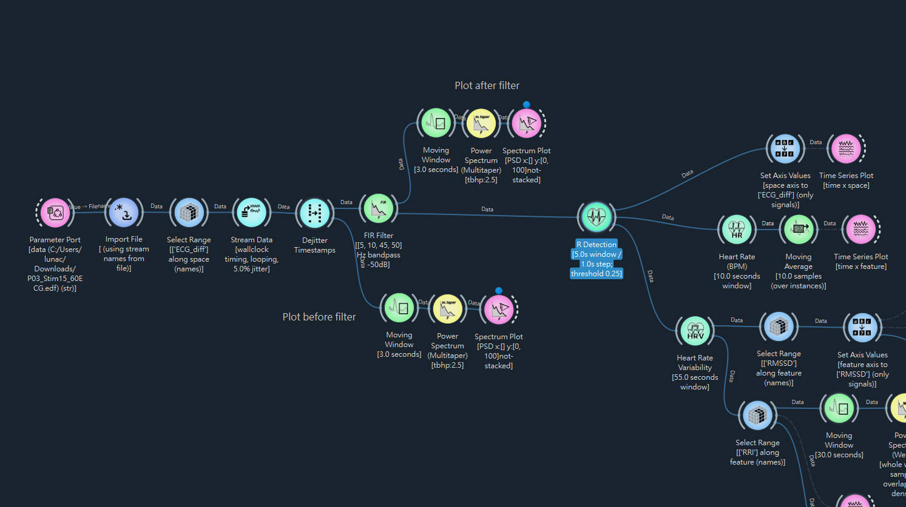
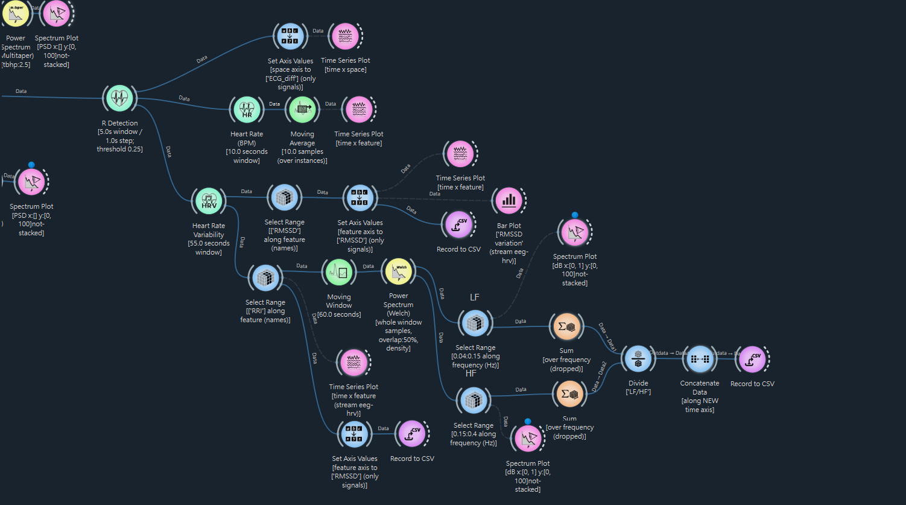
| Node | Function |
|------|----------|
| `SelectRange (ECG_diff)` | Select the ECG channel |
| `FIRFilter [5, 10, 45, 50 Hz]` | Remove T-wave low-frequency components that cause R-peak misdetection, while preserving R-peak energy (8–20 Hz) |
| `RDetection (sensitivity=0.25)` | Detect R peaks using adaptive threshold |
| `HeartRateVariability (window=55s)` | Extract RMSSD and RRI from detected R peaks |
| `MovingWindow (300s) → WelchSpectrum → SelectRange (LF/HF) → Divide` | Compute LF/HF ratio as autonomic balance indicator |

Parameter Justification

### EEG Parameters

| Parameter | Justification |
|-----------|--------------|
| `FIRFilter [0.25, 4, 30, 50 Hz]` | Isolates critical brain waves for emotion analysis while removing low-frequency eye blinks and high-frequency muscle noise |
| `ArtifactRemoval (cutoff=15)` | Detects and cleans sudden signal distortions without compromising genuine EEG signal |
| `MovingWindow (3s)` | Captures real-time dynamic emotional shifts for frequency analysis |
| `Averages` | Computes band power for delta (1–4 Hz), theta (4–8 Hz), alpha (8–12 Hz), beta (12–30 Hz), gamma (30–50 Hz) |
| `SelectRange (space & frequency)` | Isolates frontal electrodes F3 and F4, then targets frequency index 2 to extract alpha band power (8–12 Hz) |

### ECG Parameters

| Parameter | Justification |
|-----------|--------------|
| `FIRFilter [5, 10, 45, 50 Hz]` | Removes baseline wander and electrical noise. High-pass cutoff intentionally raised to 10 Hz (stopband at 5 Hz) to suppress abnormally high-amplitude T-waves in this dataset, isolating sharp QRS complexes for accurate R-peak detection |
| `RDetection (sensitivity=0.25, window=5s)` | Identifies individual heartbeats using a 5.0-second processing window with a relative amplitude threshold of 0.25 |
| `HeartRateVariability (window=55s)` | 55-second sliding window extracts continuous RRI and RMSSD features |
| `MovingWindow (300s)` | Buffers RRI for spectral frequency analysis |
| `SelectRange (LF/HF)` | Selects 0.04–0.15 Hz (LF) and 0.15–0.4 Hz (HF) bands for autonomic balance calculation |

 How to Run 

  
1. Open **NeuroPype Pipeline Designer**
2. Load `pipeline/HIP_FinalProject_Group10_Pipeline.pyp`
3. Update the file path in the **ParameterPort** node to your local `.edf` file
4. Run the pipeline

## 5. Demo Video

<!-- 影片連結放這裡 -->

## 6. Results & Interpretation

EEG — Frontal Alpha Asymmetry (FAA: αF4/αF3)

| Participant | S1 (Calm) | S4 (Fear) | S11 (Calm) | S15 (Fear) |
|-------------|-----------|-----------|------------|------------|
| P3 | -4.969 | 0.585 | 1.105 | 0.590 |
| P4 | 1.931 | -0.472 | 1.635 | 0.705 |

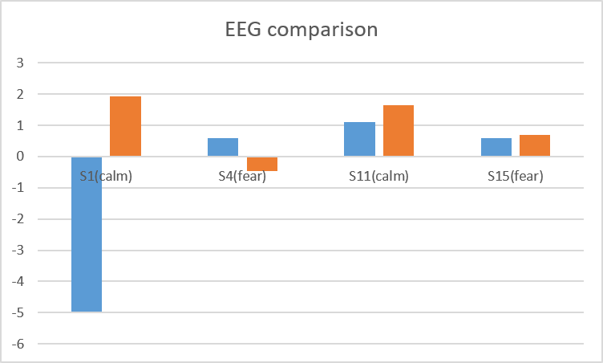
An αF4/αF3 ratio > 1 reflects left-hemisphere dominance and positive affect, predicting higher valence for calm than fear. Excluding anomalous negative values in P3S1 and P4S4, results supported this expectation: ratios exceeded 1 in calm conditions (positive affect) and fell below 1 in fear conditions (negative affect).

ECG — RMSSD

| Participant | S1 (Calm) | S4 (Fear) | S11 (Calm) | S15 (Fear) |
|-------------|-----------|-----------|------------|------------|
| P3 | 35.45 | 47.43 | 45.08 | 39.22 |
| P4 | 55.00 | 49.94 | 54.19 | 63.46 |

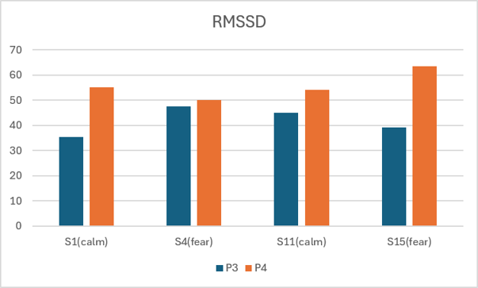
RMSSD reflects parasympathetic activity (normal range: 20–50 ms; < 20 ms indicates high sympathetic activity). While the expected pattern was calm > fear, most values fell within the normal range with no significant difference between conditions.

ECG — LF/HF Ratio

| Participant | S1 (Calm) | S4 (Fear) | S11 (Calm) | S15 (Fear) |
|-------------|-----------|-----------|------------|------------|
| P3 | 0.211 | 0.472 | 0.348 | 0.780 |
| P4 | 0.450 | 0.506 | 0.379 | 0.629 |

. Results aligned with the expected calm < fear pattern: fear conditions consistently elicited higher LF/HF ratios. Notably, P3 showed ratios < 0.5 during calm, highlighting pronounced parasympathetic activity.

<table>
  <tr>
    <td>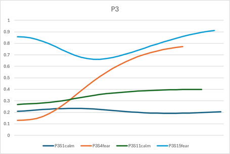</td>
    <td>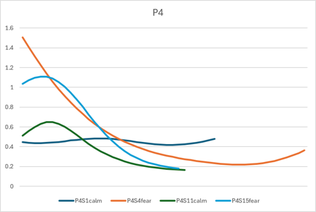</td>
  </tr>
</table>

**Moving Window Analysis:** Dynamic patterns were revealed that static averages obscure. P3 demonstrated gradual emotional accumulation, with fear ratios (S4, S15) climbing over time. P4 exhibited strong initial arousal followed by rapid habituation.

Neurophysiological Interpretation

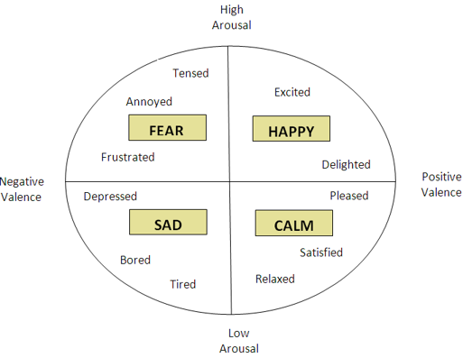
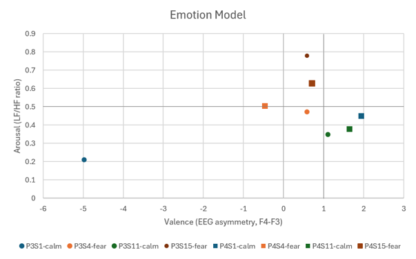
By mapping αF4/αF3 and LF/HF values onto Russell's Circumplex Model of Affect, results largely aligned with theoretical expectations. The calm condition (S11) demonstrated higher valence and lower arousal, whereas the fear condition (S15) exhibited lower valence and higher arousal — illustrating that calm and fear elicit distinct, measurable shifts in both frontal cortical asymmetry and autonomic heart rate variability.

**Limitations:**
- Analysis of only two participants introduces individual difference biases.
- Restricting data to the final 60 seconds may limit analysis of broader temporal dynamics in emotional responses.

